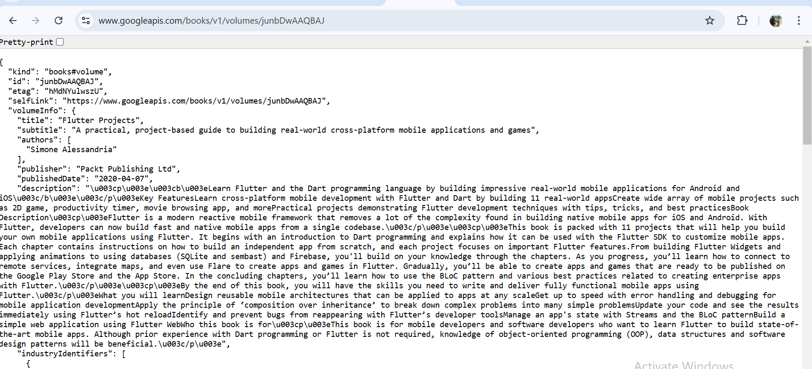

# flutter_books

## pratikum 1 : mengunduh data dari web service (api) = , 

## pratikum 2 : menggunakan await/async untuk menghindari callbacks = lupa ss (kode 1. Kode di atas berisi tiga fungsi asinkron di Dart: returnOneAsync, returnTwoAsync, dan returnThreeAsync. Masing-masing fungsi: Menunda eksekusi selama 3 detik menggunakan Future.delayed, Mengembalikan nilai 1, 2, atau 3 setelah penundaan. kode 2. Kode di atas adalah sebuah fungsi asynchronous (async) dalam Flutter/Dart yang menghitung nilai total dari tiga fungsi asynchronous lainnya.)

## pratikum 3 : Menggunakan Completer di Future = 

## Praktikum 5: Menangani Respon Error pada Async Code = 

## Praktikum 6: Menggunakan Future dengan StatefulWidget = 

## Praktikum 8: Navigation route dengan Future Function =  

## Praktikum 9: Memanfaatkan async/await dengan Widget Dialog = 

## Getting Started

This project is a starting point for a Flutter application.

A few resources to get you started if this is your first Flutter project:

- [Lab: Write your first Flutter app](https://docs.flutter.dev/get-started/codelab)
- [Cookbook: Useful Flutter samples](https://docs.flutter.dev/cookbook)

For help getting started with Flutter development, view the
[online documentation](https://docs.flutter.dev/), which offers tutorials,
samples, guidance on mobile development, and a full API reference.
